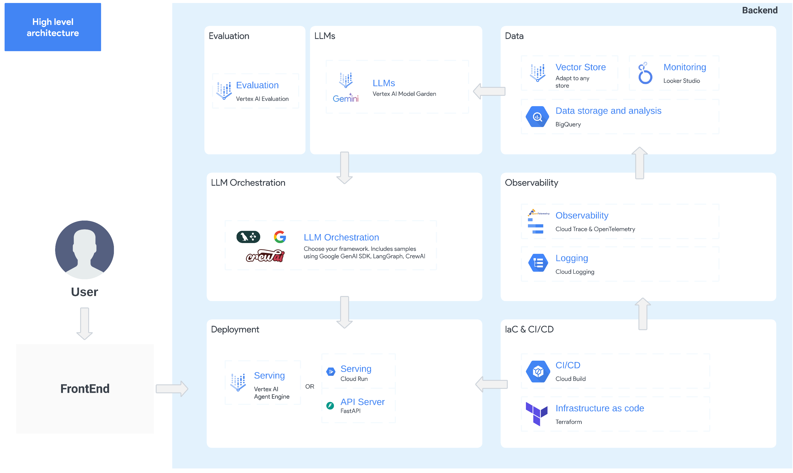

# 🚀 Agent Starter Pack

 [](https://youtu.be/jHt-ZVD660g) [](./docs/README.md)


The `agent-starter-pack` is a collection of production-ready Generative AI Agent templates built for Google Cloud. <br>
It accelerates development by providing a holistic, production-ready solution, addressing common challenges (Deployment & Operations, Evaluation, Customization, Observability) in building and deploying GenAI agents.

| ⚡️ Launch | 🧪 Experiment  | ✅ Deploy | 🛠️ Customize |
|---|---|---|---|
| [Pre-built agent templates](./agents/) (ReAct, RAG, multi-agent, Live Multimodal API). | [Vertex AI evaluation](https://cloud.google.com/vertex-ai/generative-ai/docs/models/evaluation-overview) and an interactive playground. | Production-ready infra with [monitoring](./docs/monitoring.md), [observability](./docs/observability.md), and [CI/CD](./docs/deployment.md) on [Cloud Run](https://cloud.google.com/run) or [Agent Engine](https://cloud.google.com/vertex-ai/generative-ai/docs/agent-engine/overview). | Extend and customize templates according to your needs. |

---
 
## ⚡ Get Started in 1 Minute

Ready to build your AI agent? Simply run this command:

```bash
# Create and activate a Python virtual environment
python -m venv venv && source venv/bin/activate

# Install the agent starter pack
pip install agent-starter-pack

# Create a new agent project
agent-starter-pack create my-awesome-agent
```

**That's it!** You now have a fully functional agent project—complete with backend, frontend, and deployment infrastructure—ready for you to explore and customize.
For more installation options, see the [Installation Guide](docs/installation.md).

---

 🆕 The starter pack offers full support for Agent Engine, a new fully managed solution to deploy agents. Simply run this command to get started:

```bash
agent-starter-pack create my-agent -d agent_engine -a langgraph_base_react
```


*See the [full list of options](docs/cli/create.md) for details.*

## 🤖 Agents

| Agent Name                  | Description                                                                                                                       |
|-----------------------------|-----------------------------------------------------------------------------------------------------------------------------------|
| `langgraph_base_react`      | A agent implementing a base ReAct agent using LangGraph |
| `agentic_rag_vertexai_search` | A RAG agent using Vertex AI Search and LangGraph for document retrieval and Q&A       |
| `crewai_coding_crew`       | A multi-agent system implemented with CrewAI created to support coding activities       |
| `multimodal_live_api`       | A real-time multimodal RAG agent powered by Gemini, supporting audio/video/text chat with vector DB-backed responses                       |

**More agents are on the way!** We are continuously expanding our [agent library](./agents/).  Have a specific agent type in mind?  [Contribute!](#contributing)


#### Extra Features

The `agent-starter-pack` offers two key features to accelerate and simplify the development of your agent:

- **🔄 [CI/CD Automation (Experimental)](docs/cli/setup_cicd.md)** - One command to set up a complete GitHub + Cloud Build pipeline for all environments
- **📥 [Data Pipeline for RAG with Vertex AI Search and Terraform/CI-CD](docs/data-ingestion.md)** - Seamlessly integrate a data pipeline to process embeddings for RAG into your agent system.


## High-Level Architecture

This starter pack covers all aspects of Agent development, from prototyping and evaluation to deployment and monitoring.



---

#### From `e2e-gen-ai-app-starter-pack` to `agent-starter-pack`

This project represents the next evolution of the [e2e-gen-ai-app-starter-pack](goo.gle/e2e-gen-ai-app-starter-pack).  Building on the foundation of the original, we've made significant improvements:

*   **Streamlined CLI:**  A new command-line interface (`agent-starter-pack`) simplifies project creation, template selection, and deployment.
*   **Expanded Agent Options:**  Support for a wider variety of agent frameworks (LangGraph, CrewAI, and the Google Agent Framework SDK) and deployment targets (including Vertex AI Agent Engine).
*   **Simplified setup**: Integrated gcloud authentication and projects and region configurations

---

## 🔧 Requirements

- Python 3.10+
- [Google Cloud SDK](https://cloud.google.com/sdk/docs/install)
- [Terraform](https://developer.hashicorp.com/terraform/downloads) (for deployment)


## 📚 Documentation
See the [documentation](docs/) for more details:

- [Why Use the Starter Pack?](docs/why_starter_pack.md)
- [Installation](docs/installation.md)
- [Deployment](docs/deployment.md)
- [Data Ingestion](docs/data-ingestion.md)
- [Observability](docs/observability.md)
- [CLI Reference](docs/cli/README.md)
- [Troubleshooting](docs/troubleshooting.md)

**Video Walkthrough:** A [20-Minute Video Walkthrough](https://youtu.be/kwRG7cnqSu0) is available, showcasing the previous `e2e-gen-ai-app-starter-pack`. A new walkthrough for the `agent-starter-pack` will be released soon!

## Contributing

Contributions are welcome! See the [Contributing Guide](CONTRIBUTING.md).

## Feedback

We value your input! Your feedback helps us improve this starter pack and make it more useful for the community.

### Getting Help

If you encounter any issues or have specific suggestions, please first consider [raising an issue](https://github.com/GoogleCloudPlatform/generative-ai/issues) on our GitHub repository.

### Share Your Experience

For other types of feedback, or if you'd like to share a positive experience or success story using this starter pack, we'd love to hear from you! You can reach out to us at <a href="mailto:agent-starter-pack@google.com">agent-starter-pack@google.com</a>.

Thank you for your contributions!

## Disclaimer

This repository is for demonstrative purposes only and is not an officially supported Google product.

## Terms of Service

The agent-starter-pack templating CLI and the templates in this starter pack leverage Google Cloud APIs. When you use this starter pack, you'll be deploying resources in your own Google Cloud project and will be responsible for those resources. Please review the [Google Cloud Service Terms](https://cloud.google.com/terms/service-terms) for details on the terms of service associated with these APIs.
