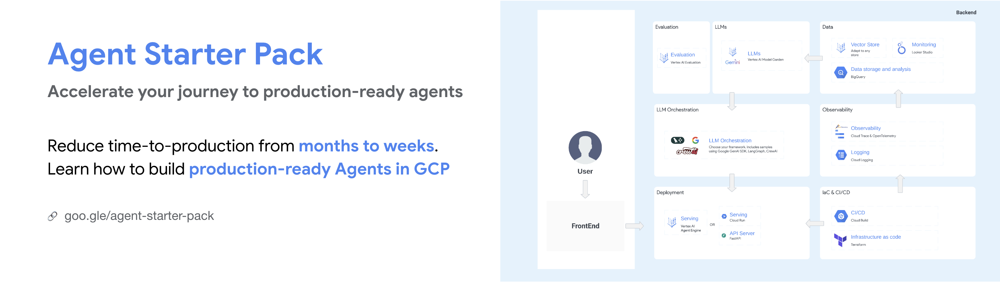

# Why a Starter Pack? Accelerating GenAI Agent Development on Google Cloud

Operationalizing Generative AI Agents can be a complex and time-consuming process.  Many developers and organizations face similar challenges, often taking many months to move from a successful Proof of Concept (PoC) to a production-ready GenAI application.  

This starter pack tries to address those challenges.

## The Challenges of Building Production-Ready Agents
Moving from a prototype to a production-ready, scalable, and secure deployment can be challenging.
These challenges typically fall into several key areas:

### Deployment & Operations

*   **Infrastructure:** Scalable & robust infrastructure.
*   **Testing:** Comprehensive testing strategy (unit, integration, load).
*   **Deployment:** CI/CD pipelines, rapid iteration & rollback mechanisms.
*   **UI Integration:** Seamless & consistent UX.

### Evaluation

*   **Performance Measurement:** Assessing performances before deployment.
*   **Synthetic Data:** Generating synthetic data for evaluation and tuning.

### Customization

*   **Business Logic:** Integrating custom product logic.
*   **Security & Compliance:** Data privacy, access control, adversarial attack mitigation.

### Observability

*   **Data Collection:** User data for monitoring, evaluation & fine-tuning.
*   **Performance Monitoring:** Real-time application health.
*   **User Feedback:** Collection & processing mechanisms.

## Agent Starter Pack: An Approach

The Agent Starter Pack provides one possible approach to reduce this time-to-production by aiming to provide a holistic solution for developers building robust, scalable, and secure GenAI applications and agents on Google Cloud Platform (GCP).  It offers a **possible solution** to the challenges outlined above by providing:

*   **Ready-to-Use Agent:** A library of pre-built agent templates that you can use as a starting point for your own applications.  This eliminates the need to build common agent architectures from scratch.

*   **Production-Ready Deployment Targets:** Choose between a pre-built FastAPI server with real-time chat interface and auto-generated documentation, or fully managed Agent Engine which offers a fully managed server infrastructure. 

*   **UI Playground for Experimentation:** An interactive playground (with multimodal support, chat curation and more) for rapid prototyping, testing, and refinement. This allows you to quickly iterate on your agent's design and functionality.

*   **CI/CD and Terraform:** Automated CI/CD pipelines (using GitHub and Cloud Build) and infrastructure-as-code (using Terraform) for quick and reliable deployments across development, staging, and production environments.

*   **GCP Native Observability:** Integrated monitoring and logging using Cloud Trace and Cloud Logging, including a pre-built Looker dashboard for visualizing key metrics. This provides immediate insights into your agent's performance and health.

*    **Evaluation** An interactive playground to help you evaluate and test, along with getting started notebooks for evaluation.
